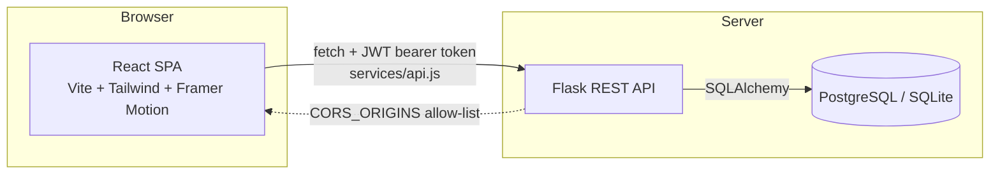
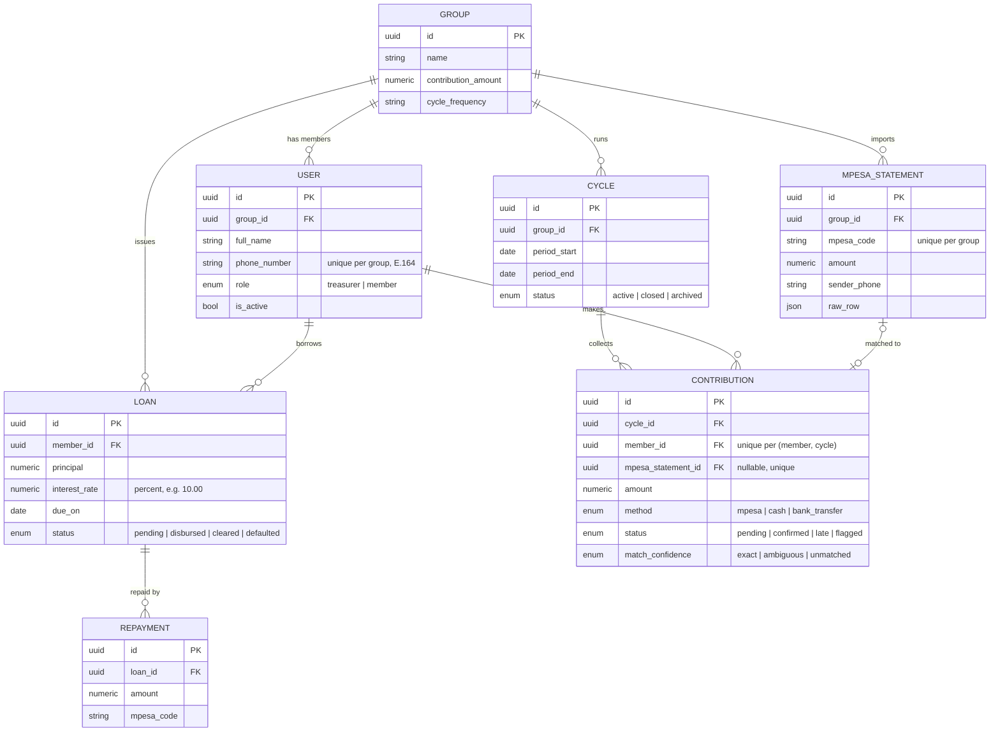

# ChamaLedger — Technical Documentation

This is the deep reference: architecture, data model, full API contract, and a page-by-page tour of the
frontend. For "how do I run this," see the [README](./README.md) instead.

## Table of contents

- [Architecture](#architecture)
- [Backend](#backend)
  - [App factory & configuration](#app-factory--configuration)
  - [Authentication & authorization](#authentication--authorization)
  - [Data model](#data-model)
  - [API reference](#api-reference)
  - [Services](#services)
- [Frontend](#frontend)
  - [Routing](#routing)
  - [State: the auth store](#state-the-auth-store)
  - [The API service layer](#the-api-service-layer)
  - [Hooks](#hooks)
  - [Pages](#pages)
  - [Design system](#design-system)
- [End-to-end walkthroughs](#end-to-end-walkthroughs)
- [Environment variables](#environment-variables)
- [Known limitations & roadmap](#roadmap--next-steps)
- [Troubleshooting](#troubleshooting)

---

## Architecture



The frontend is a pure client — it holds no server state beyond a persisted JWT. Every screen fetches what it
needs from the API on mount via a small set of resource hooks (`useCycles`, `useLoans`, etc.), all funneled
through one file, `src/services/api.js`, so there's exactly one place that knows how to talk to the backend.

The backend is a conventional Flask app-factory app: blueprints per resource, SQLAlchemy models with a single
`enums.py` as the source of truth for every status field, and two small service modules (`loan_engine`,
`reconcile_engine`) that hold business logic the routes shouldn't.

---

## Backend

### App factory & configuration

`app/__init__.py` builds the app via `create_app()`:

1. Loads config from `app.config.Config` (itself populated from environment variables via `python-dotenv`)
2. Initializes `SQLAlchemy`, `Flask-Migrate`, `Flask-JWT-Extended`
3. Initializes `Flask-CORS`, scoped to `/api/*`, restricted to the origins in `CORS_ORIGINS`
4. Registers all six blueprints (`auth`, `groups`, `cycle`, `contributions`, `loans`, `reconcile`)
5. Registers JSON error handlers for missing/invalid/expired JWTs so every auth failure returns the same
   `{"error": "Unauthorized", "message": "..."}` shape as everything else
6. Exposes `GET /health` for uptime checks

Every config value is read from the environment with a local-dev fallback (see
[Environment variables](#environment-variables)) — nothing is hardcoded for a single environment.

### Authentication & authorization

- **Login/registration** issue a JWT (`Flask-JWT-Extended`) with the user's `id` as `identity`, plus three
  **custom claims**: `group_id`, `role`, and `full_name`. This means every request carries enough context to
  authorize a group-scoped action without a second database lookup.
- **Route-level auth** comes in two flavors:
  - `@jwt_required()` — any authenticated user
  - `@roles_required("treasurer")` (in `app/core/decorators.py`) — authenticated *and* the `role` claim matches
- **Group scoping** is enforced by hand in nearly every route:
  ```python
  claims = get_jwt()
  if claims.get("group_id") != str(group_id):
      return jsonify({"error": "Forbidden", "message": "Access restricted to group members"}), 403
  ```
  This means a valid token from Group A can never read or write Group B's data, even if it knows a Group B
  resource ID.
- **Member-level scoping**: list endpoints (contributions, loans) automatically filter to `member_id ==
  <token identity>` when the caller isn't a treasurer, so members only ever see their own records without the
  frontend having to ask for it specially.

There is currently **no token refresh** — a JWT is valid until it expires, at which point the frontend's global
401 handler (see [State: the auth store](#state-the-auth-store)) logs the user out.

### Data model



A few details worth calling out because they shape both the API and the UI:

- **`Contribution.member_id` is `NOT NULL`.** A statement can only become a contribution once a specific
  member has been identified — there's no "orphan" contribution with no owner. This is why reconciliation
  reports unmatched *statements*, not unmatched contributions (see [Services](#services)).
- **One contribution per member per cycle**, enforced at the database level (`uq_member_cycle`). Recording a
  second contribution for the same member in the same cycle is rejected with `409 Conflict`.
- **`Loan.total_payable` / `total_paid` / `remaining_balance` are computed properties**, not columns — simple
  interest (`principal × (1 + rate / 100)`) calculated from `interest_rate` and the sum of `repayments`, always
  in sync with the ledger of repayments rather than a cached number that could drift.
- **Every enum lives in `app/models/enums.py`.** The frontend's `StatusChip` component maps every one of these
  string values to a color; if you add a new enum member, add it there too.

### API reference

All endpoints are prefixed `/api/v1`. Authenticated endpoints expect `Authorization: Bearer <token>`.
Every error response has the shape `{"error": "<category>", "message": "<human-readable detail>"}`, and every
mutation that succeeds returns a `"message"` field alongside the resource.

#### Auth — `/api/v1/auth`

| Method | Path | Auth | Description |
|---|---|---|---|
| POST | `/register` | — | Create a user. Either `group_name` (+ optional `contribution_amount`, `cycle_frequency`) to found a new group as its treasurer, or `group_id` to join an existing one as a member. |
| POST | `/login` | — | Exchange `phone_number` + `password` for a JWT. |
| POST | `/logout` | JWT | Stateless — the frontend just discards the token; this exists for symmetry / future token-blacklisting. |
| GET | `/me` | JWT | Current user's profile, including `group_name`. |

<details>
<summary><strong>POST /register</strong> — request / response</summary>

```jsonc
// Request (new group)
{
  "full_name": "Amina Yusuf",
  "phone_number": "0712345678",
  "password": "Treasurer#2026",
  "group_name": "Malkia Women Sacco",
  "contribution_amount": 200,
  "cycle_frequency": "monthly"
}

// Request (joining a group)
{
  "full_name": "Zainab Kimani",
  "phone_number": "0722111222",
  "password": "Member#2026",
  "group_id": "046c1a93-a634-425a-b87c-04d5df13b330"
}

// 201 response
{
  "message": "User registered successfully",
  "access_token": "eyJ...",
  "user": {
    "id": "...", "group_id": "...", "full_name": "Amina Yusuf",
    "phone_number": "+254712345678", "role": "treasurer"
  }
}
```
`409` if the phone number is already registered in that group. `404` if `group_id` doesn't exist.
</details>

#### Groups — `/api/v1/groups`

| Method | Path | Auth | Description |
|---|---|---|---|
| GET | `/:groupId` | JWT, same group | Group name, contribution amount, cycle frequency, member count. |
| PATCH | `/:groupId` | Treasurer | Update `name`, `contribution_amount`, and/or `cycle_frequency`. |
| GET | `/:groupId/members` | JWT, same group | All members, newest-joined last. |
| PATCH | `/:groupId/members/:memberId` | Treasurer | Update `role` (`treasurer`/`member`) and/or `is_active`. |

#### Cycles — `/api/v1/cycles`

| Method | Path | Auth | Description |
|---|---|---|---|
| GET | `/:groupId` | JWT, same group | All cycles, most recent first. |
| POST | `/:groupId` | Treasurer | Open a cycle: `{ "period_start": "2026-07-01", "period_end": "2026-07-31" }`. |
| PATCH | `/:groupId/:cycleId/close` | Treasurer | Marks the cycle `closed`. Only valid from `active`. |
| GET | `/:groupId/:cycleId/summary` | JWT, same group | The financial summary — see below. |

<details>
<summary><strong>GET /:groupId/:cycleId/summary</strong> — response</summary>

```jsonc
{
  "group_id": "...",
  "cycle": { "id": "...", "period_start": "2026-07-01", "period_end": "2026-07-31", "status": "active" },
  "financial_summary": {
    "expected_per_member": 200.0,
    "total_members": 2,
    "total_expected": 400.0,
    "total_collected": 200.0,
    "total_deficit": 200.0,
    "collection_rate_percentage": 50.0
  },
  "breakdown": { "paid_in_full": 1, "partial_payment": 0, "unpaid": 1 },
  "defaulters": [ { "user_id": "...", "full_name": "Zainab Kimani", "amount_paid": 0, "balance_due": 200, "status": "pending" } ],
  "members": [ /* every member, same shape as defaulters entries */ ]
}
```

This single endpoint powers both the Dashboard's "this cycle" cards and the full Cycle Detail page — the
frontend never has to stitch together member + contribution data itself.
</details>

#### Contributions — `/api/v1/contributions`

| Method | Path | Auth | Description |
|---|---|---|---|
| GET | `/:groupId/cycles/:cycleId` | JWT | List contributions for a cycle. Treasurers see everyone's; members see only their own (enforced server-side). |
| POST | `/:groupId/cycles/:cycleId` | Treasurer | Manually record a contribution: `{ "member_id", "amount", "method" ("cash"\|"bank_transfer"\|"mpesa"), "mpesa_code"? }`. `409` if that member already has a contribution this cycle. |
| PATCH | `/:groupId/:contributionId` | Treasurer | Update `status` — used to resolve a `flagged` reconciliation match. |

#### Loans — `/api/v1/loans`

| Method | Path | Auth | Description |
|---|---|---|---|
| GET | `/:groupId` | JWT | List loans (member-scoped for non-treasurers, same as contributions). |
| POST | `/:groupId` | Treasurer | Issue a loan: `{ "member_id", "principal", "interest_rate"?, "due_on" }`. Rejected with `400` if the member already has an active loan or the principal exceeds `3× their confirmed contributions` (see [loan_engine](#services)). |
| GET | `/:groupId/:loanId` | JWT, owner or treasurer | Full loan detail including `repayments[]`. |
| POST | `/:groupId/:loanId/repayments` | Treasurer | Record a repayment: `{ "amount", "mpesa_code"? }`. Auto-sets the loan to `cleared` once `remaining_balance <= 0`. |

#### Reconcile — `/api/v1/reconcile`

| Method | Path | Auth | Description |
|---|---|---|---|
| POST | `/:groupId/:cycleId/upload` | Treasurer | Multipart `file` field, an M-Pesa statement CSV (must include `Receipt No.`, `Completion Time`, `Paid In` columns). Imports new rows (skipping duplicates by receipt number) and attempts to match each against the cycle. |
| GET | `/:groupId/unmatched` | Treasurer | Statement rows that never got linked to a contribution. |

<details>
<summary><strong>POST /:groupId/:cycleId/upload</strong> — response</summary>

```jsonc
{
  "message": "Statement uploaded and reconciled",
  "rows_imported": 14,
  "rows_skipped_as_duplicates": 2,
  "matches": {
    "exact": 11,
    "ambiguous": 1,
    "unmatched": 2,
    "unmatched_statement_ids": ["...", "..."]
  }
}
```
</details>

### Services

Two modules hold logic that doesn't belong in a route handler:

- **`app/services/loan_engine.py`** — `check_loan_eligibility(member, principal)`. A member can't have two
  active loans at once, and a new loan's principal can't exceed **3× their total confirmed contributions**
  (`MAX_LOAN_TO_SAVINGS_RATIO`). Change that constant to tune lending policy without touching the route.

- **`app/services/reconcile_engine.py`** — matches each uploaded M-Pesa statement row to a member, in order of
  confidence:
  1. **Exact** — the statement's sender phone matches a group member's phone exactly.
  2. **Ambiguous** — no phone match, but exactly one member in the cycle is still unpaid *and* the amount
     equals the group's expected contribution — tentatively matched, flagged for the treasurer to confirm.
  3. **Unmatched** — neither narrows it to one member. No `Contribution` row is created (it can't be — see the
     `NOT NULL member_id` note above); the statement shows up in `GET /reconcile/:groupId/unmatched` instead.

---

## Frontend

### Routing

`src/routes/AppRoutes.jsx` defines the whole map. `/login` is public (and redirects to `/` if you're already
authenticated); everything else sits behind `ProtectedRoute`, which itself wraps `AppLayout` (nav bar + themed
page canvas):

| Path | Page | Guard |
|---|---|---|
| `/login` | `LoginPage` | Public |
| `/` | `DashboardPage` | Authenticated |
| `/cycles/:cycleId` | `CycleDetailPage` | Authenticated (`cycleId="new"` shows the create-cycle form instead) |
| `/members` | `MembersPage` | Authenticated |
| `/loans`, `/loans/:loanId` | `LoansPage` | Authenticated |
| `/reconcile` | `ReconcilePage` | Authenticated **and** treasurer (`<ProtectedRoute treasurerOnly />`) |

Any unmatched path redirects to `/`.

### State: the auth store

`src/store/useAuthStore.js` is a small Zustand store, persisted to `localStorage` under the key
`chamaledger-auth`:

```js
{ token, user, status, error,
  isAuthenticated(), isTreasurer(),
  login({phone_number, password}), register(payload), logout(), clearError() }
```

`services/api.js` reads the token directly out of that same `localStorage` key (rather than importing the
store, which would create a circular import), and calls a registered `onUnauthorized` callback on any `401` —
the store uses that hook to clear itself, so an expired token logs the user out cleanly from anywhere in the
app, not just on the next explicit auth check.

### The API service layer

`src/services/api.js` is the *only* file that calls `fetch`. It exports:

- `ApiError` — carries `.status` and `.payload` alongside the message, so callers can branch on status codes
  if they need to.
- `api.{auth,groups,cycles,contributions,loans,reconcile}.*` — one method per backend endpoint, e.g.
  `api.loans.issue(groupId, payload)`, `api.cycles.summary(groupId, cycleId)`. Every hook and every form
  handler in the app goes through this object — nothing constructs a URL string anywhere else.

`VITE_API_URL` (from `.env`) sets the base URL; it defaults to `http://localhost:5000` if unset.

### Hooks

One hook file per backend resource, each following the same shape — `{ data, status, error, refetch, ...mutations }`
— so any page can add loading/error UI the same way:

| Hook | Wraps |
|---|---|
| `useCycles(groupId)` / `useCycleSummary(groupId, cycleId)` | list, create, close / the summary endpoint |
| `useMembers(groupId)` | list + update |
| `useLoans(groupId)` / `useLoanDetail(groupId, loanId)` | list, issue, repay / single-loan detail |
| `useContributions(groupId, cycleId)` | list + record |
| `useReconcile(groupId)` | unmatched list + upload |

These are hand-rolled (`useState` + `useEffect` + `useCallback`), not React Query — deliberately, to keep the
dependency list small. If the app grows enough that cache invalidation across hooks becomes painful, that's
the natural next upgrade (see [Roadmap](#roadmap--next-steps)).

### Pages

- **`LoginPage`** — single page, two tabs (Log in / Create account). The create-account tab has its own
  toggle: *start a group* (name, contribution amount, cycle frequency — becomes treasurer) vs. *join a group*
  (paste a Group ID — becomes a member). Client-side phone validation via `utils/phoneSanitizer.js` mirrors
  the backend's normalizer so bad input is caught before a request is even sent.

- **`DashboardPage`** — the bento-grid overview. Finds the group's active cycle (or most recent), pulls its
  summary, and shows: *this cycle's contribution* (with an animated progress bar toward the expected amount),
  *outstanding loan* (with a live day/hour countdown to `due_on`), and *group pool this cycle* (a circular
  gauge driven by `collection_rate_percentage` — the one deliberately signature visual element, meant to
  evoke the literal "circle" in Chama). Treasurers additionally see a defaulters callout. Quick-action buttons
  route to the relevant page rather than acting inline, since the actual mutations live there.

- **`CycleDetailPage`** — cycle switcher dropdown, financial summary tiles, breakdown counts, and the full
  member table with inline "Record" contribution forms for treasurers. `cycleId="new"` renders a small
  create-cycle form instead (this is what the Dashboard's empty state links to).

- **`MembersPage`** — the member table, plus (treasurer-only) a copyable Group ID card for inviting new
  members, and inline role/active-status controls per row.

- **`LoansPage`** — table of loans, an "Issue loan" form (treasurer), and a detail panel (opened by clicking a
  row) showing repayment history and a repay form (treasurer-only; members are shown "contact your treasurer"
  instead of a broken action, matching what the API actually allows).

- **`ReconcilePage`** *(treasurer-only)* — pick a cycle, upload a CSV, see match counts, review the unmatched
  table.

### Design system

Defined once, in `src/index.css`, as Tailwind v4 `@theme` tokens — not scattered `bg-[#...]` literals:

- **Color**: a deep violet-black ground (`--color-ink-950`) rather than navy, so the palette's emerald
  (`--color-gain-*`, gains/positive) and rose (`--color-rose-*`, loans/attention) accents read warm instead of
  clinical. A restrained gold (`--color-gold-*`) marks premium/in-progress states.
- **Type**: Fraunces (display serif, headings and money figures) paired with Plus Jakarta Sans (UI text) —
  loaded via Google Fonts in `index.html`.
- **Motion**: every entrance uses the same cascade (`opacity 0→1, y 15→0, 0.4s`, staggered by index) via the
  shared `GlassCard` component, and every animated element checks Framer Motion's `useReducedMotion()` so
  `prefers-reduced-motion` users get an instant static layout instead of stripped-down motion.
- **Accessibility**: visible gold focus rings (never suppressed), semantic `<table>` markup with scoped
  headers and screen-reader captions in the shared `Table` component, `aria-label`s on every icon-only button.

---

## End-to-end walkthroughs

**Starting a group.** Treasurer registers with `group_name` → backend creates the `Group` and the user as
`treasurer` in one transaction → frontend stores the JWT and lands on `/`, which shows the empty-cycle state
→ treasurer clicks "Open a cycle" → `/cycles/new` → `POST /cycles/:groupId` → redirected to
`/cycles/:cycleId`, now showing the real (empty) summary.

**A member joins.** Treasurer copies the Group ID from `/members`. A new user registers with `group_id` set
instead of `group_name` → backend attaches them as `member` → they land on the same dashboard, scoped to
their own contribution/loan data by the JWT claims.

**Recording a contribution.** On `/cycles/:cycleId`, the treasurer clicks "Record" next to a member row →
inline form (`amount`, `method`) → `POST /contributions/:groupId/cycles/:cycleId` → the cycle summary
refetches, so the member's row, the breakdown counts, and the collection-rate gauge all update together.

**Reconciling M-Pesa.** Treasurer exports a statement from M-Pesa, picks the cycle on `/reconcile`, uploads
the CSV → backend parses rows, skips ones already imported (by receipt number), and for each new row: matches
by phone (exact), or by "only one unpaid member at the expected amount" (ambiguous), or leaves it for the
unmatched list. The response's match counts render immediately; the unmatched table refetches automatically.

---

## Environment variables

### Backend (`backend/.env`)

| Variable | Default | Notes |
|---|---|---|
| `SECRET_KEY` | `abdalla-dev-secret-key` | Flask session/signing key — **change in production**. |
| `JWT_SECRET_KEY` | `abdalla-dev-jwt-secret-key` | Signs issued tokens — **change in production**. |
| `DATABASE_URL` | — | Takes priority if set. Falls back to `SQLALCHEMY_DATABASE_URI`, then `sqlite:///chamaledger.db`. |
| `CORS_ORIGINS` | `http://localhost:5173,http://localhost:4173` | Comma-separated allow-list of frontend origins. **Must include your real frontend URL or every browser request will be blocked.** |

### Frontend (`frontend/.env`)

| Variable | Default | Notes |
|---|---|---|
| `VITE_API_URL` | `http://localhost:5000` | Base URL the frontend calls. Baked in at build time — changing it requires a rebuild, not just a server restart. |

---

## Roadmap / next steps

Gaps identified during development, in rough priority order:

1. **Member self-service.** No endpoint today lets a member request a loan, record their own repayment, or
   self-attest a cash deposit — everything routes through the treasurer. Adding a `pending` loan-request flow
   distinct from treasurer `issue` would close this.
2. **Lifetime aggregates.** The dashboard's pool/savings figures are cycle-scoped because that's all the API
   exposes. A `GET /groups/:id/summary` (or similar) that aggregates across cycles would let the dashboard show
   real historical trends instead of a per-cycle snapshot.
3. **Token refresh.** JWTs currently just expire; a refresh-token flow would avoid surprise logouts.
4. **Pydantic schemas aren't wired in.** `app/schemas/*.py` document the intended request/response contracts
   but the routes still validate by hand — worth connecting once the contracts stabilize.
5. **Notifications.** The bell icon in the nav bar is currently decorative — there's no notifications endpoint
   or model yet.

---

## Troubleshooting

**"Failed to fetch" / CORS errors in the browser console.** Your backend's `CORS_ORIGINS` doesn't include the
origin the frontend is actually running on. Check the exact `http://host:port` in your browser's address bar
and make sure it's in that comma-separated list, then restart the Flask process (env vars are read at
startup).

**Frontend builds but `VITE_API_URL` seems ignored.** Vite inlines env vars at *build* time. If you change
`.env` after `npm run build`, you need to rebuild — `npm run dev` picks up changes on restart, but a built
`dist/` won't.

**`401 Unauthorized` right after logging in.** Check that `JWT_SECRET_KEY` hasn't changed between when the
token was issued and now (e.g. a restart with a different `.env`) — that invalidates every existing token.

**A newly registered user can't see any cycles.** Cycles are opened per-group by a treasurer, not
auto-created — see "Starting a group" above.